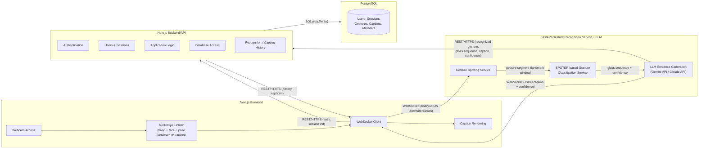

# Armenian Sign Language (ArSL) Real-Time Recognition and Captioning System

## 1. Introduction and System Architecture

The Armenian Sign Language (ArSL) Real-Time Recognition and Captioning System is designed to automatically recognize Armenian sign language gestures and convert them into readable Armenian text in real time. The system combines computer vision, machine learning, deep learning, and natural language processing technologies to provide accurate gesture recognition and sentence generation.

The primary objective of the system is to improve communication between hearing-impaired individuals and the wider community. Using a webcam, the system captures hand, face, and body movements, identifies meaningful gestures, translates them into text, and displays the generated captions instantly on the screen.

---

## 2. System Architecture and Component Interaction

The system consists of four interconnected applications/services that work together to process video input and generate natural language output: the **Next.js Frontend**, the **FastAPI Gesture Recognition Service** (Gesture Spotting + SPOTER-based Gesture Classification, together with the LLM sentence-generation step), the **Next.js Backend/API**, and **PostgreSQL**.

### High-Level Architecture Diagram

**Communication protocols and data exchanged:**

| From | To | Protocol | Data Exchanged |
| --- | --- | --- | --- |
| Next.js Frontend | Gesture Recognition Service | WebSocket | Streamed hand/face/pose landmark coordinates + timestamps |
| Gesture Spotting Service | Gesture Classification Service | Internal call (in-process / async queue) | Segmented landmark windows (active gesture segments) |
| Gesture Classification Service | LLM Sentence Generation | Internal call | Gloss sequence + confidence scores |
| Gesture Recognition Service | Next.js Frontend | WebSocket | Generated caption text + confidence score + system state |
| Next.js Frontend | Next.js Backend/API | REST/HTTPS | Authentication, session initialization, history requests |
| Gesture Recognition Service | Next.js Backend/API | REST/HTTPS | Recognized gestures, gloss sequences, captions, confidence scores (for persistence) |
| Next.js Backend/API | PostgreSQL | SQL | Users, sessions, recognized gestures, captions, related metadata |

### Frontend Layer (Next.js + MediaPipe Holistic)

The frontend application is developed using Next.js and React. It provides a user-friendly interface for accessing the webcam and displaying real-time subtitles.

Since Armenian Sign Language recognition depends not only on hand shapes but also on facial expressions and body posture (non-manual markers), the frontend uses **MediaPipe Holistic** instead of MediaPipe Hands for landmark extraction. MediaPipe Holistic produces:

* **Hand landmarks** — 21 key points per hand, each represented by three-dimensional coordinates (x, y, z).
* **Face landmarks** — key facial points used to capture expressions and head orientation relevant to sign-language grammar (e.g., interrogative or negative markers).
* **Pose landmarks** — upper-body/shoulder key points describing overall body posture and movement.

Together, these hand, face, and pose landmarks form the combined skeletal representation used as input to the recognition model, in the format required by the selected SPOTER configuration.

### Data Transmission Layer (WebSocket)

The extracted landmark coordinates are transmitted to the **Gesture Recognition Service** using WebSocket technology, not to the "backend" in a generic sense. This approach enables low-latency, bidirectional communication between the client and the Gesture Recognition Service, making real-time recognition possible.

The Next.js Backend/API is a separate application, responsible for application-level functionality (authentication, sessions, database access, recognition/caption history) and is not part of this real-time landmark transmission path.

### Gesture Spotting Service (FastAPI)

The first component of the Gesture Recognition Service is responsible for gesture spotting. This component analyzes continuous streams of hand, face, and pose landmark data and determines when a gesture starts and ends.

A sliding window algorithm is used to measure motion intensity across consecutive frames. If the movement exceeds a predefined threshold, the system marks the sequence as an active gesture segment and forwards it to the classification service.

This stage helps eliminate unnecessary frames and reduces classification errors caused by random hand movements.

### Gesture Classification Service (FastAPI + SPOTER)

The classification service processes gesture segments received from the spotting module.

The system uses the existing **SPOTER (Sign Pose-based Transformer)** architecture, rather than a custom-designed neural network, to classify gesture sequences. The existing SPOTER model is trained/fine-tuned on the Armenian Sign Language dataset instead of implementing a new architecture from scratch.

The model receives temporal sequences of normalized pose landmarks extracted from the input video. The landmark representation includes the body components (hand, face, and/or pose) required by the selected SPOTER configuration.

Example gesture classes include:

| Class ID | Gloss     |
| -------- | --------- |
| 0        | Hello     |
| 1        | Water     |
| 2        | Thank You |
| 3        | I         |
| 4        | Want      |
| 5        | Home      |

Along with the predicted gesture, the model also outputs a confidence score indicating the reliability of the prediction.

### Natural Language Processing Layer (LLM Service)

Recognized gestures are converted into a sequence of glosses. However, sign language grammar often differs from spoken Armenian grammar.

To generate natural and grammatically correct Armenian sentences, the system uses a Large Language Model (LLM) such as Gemini API or Claude API.

For example:

**Input Gloss Sequence:**

I → Water → Want

**Generated Armenian Sentence:**

«Ես ջուր եմ ուզում։»

This module significantly improves readability and produces fluent Armenian text suitable for everyday communication.

### Backend/API Layer (Next.js Backend/API)

The Next.js Backend/API is a distinct application responsible for all application-level functionality:

* Authentication
* User and session management
* Application/business logic
* Database access
* Recognition and caption history

It receives recognized gestures, gloss sequences, and generated captions from the Gesture Recognition Service and persists them to PostgreSQL, and it serves history and account-related data back to the frontend over REST/HTTPS.

### Database Layer (PostgreSQL)

PostgreSQL is used as the primary database system for storing recognition results and user session information.

The database maintains:

* User sessions
* Recognized gestures
* Confidence scores
* Landmark history
* Generated captions

Stored data can later be used for analytics, model improvement, and performance evaluation.

---

## 3. System Workflow

The complete workflow of the system can be summarized as follows:

1. The webcam captures live video.
2. MediaPipe Holistic detects hand, face, and pose landmarks.
3. Landmark coordinates are transmitted to the Gesture Recognition Service via WebSocket.
4. The Gesture Spotting Service identifies active gesture segments.
5. The Gesture Classification Service recognizes the gesture using the SPOTER model.
6. The recognized gestures are converted into gloss sequences.
7. The LLM service transforms glosses into grammatically correct Armenian sentences.
8. The generated sentence is sent back to the frontend and displayed on the screen as live subtitles.
9. Recognition results and captions are sent to the Next.js Backend/API, which stores them in PostgreSQL and makes them available as recognition/caption history.

---

## 4. Database Design

The system database contains three primary entities:

### Sessions

Stores information about user interactions and active recognition sessions.

### Recognized Gestures

Stores detected gestures, confidence values, timestamps, and landmark data.

### Captions

Stores generated Armenian sentences and the corresponding gloss sequences.

The database structure ensures efficient storage, retrieval, and analysis of recognition results.

---

## 5. Technology Stack

| Layer                       | Technology                      | Purpose                                                            |
| --------------------------- | -------------------------------- | ------------------------------------------------------------------ |
| Frontend UI                 | Next.js 14, React, Tailwind CSS  | Webcam interface and subtitle rendering                            |
| Pose Estimation              | MediaPipe Holistic               | Extraction of hand, face, and pose landmarks                       |
| Communication                | WebSockets                       | Real-time data transfer                                             |
| Backend/API                  | Next.js Backend/API              | Authentication, users, sessions, DB access, recognition/caption history |
| Gesture Recognition Services | FastAPI                          | Asynchronous microservices (spotting + classification)               |
| Machine Learning             | PyTorch, SPOTER                  | Gesture recognition and classification                              |
| Natural Language Processing | Gemini API / Claude API          | Sentence generation                                                 |
| Database                     | PostgreSQL 16                    | Data storage and management                                        |
| Deployment                   | Docker, Docker Compose           | Containerized deployment                                            |

---

## 6. Conclusion

The Armenian Sign Language Real-Time Recognition and Captioning System provides a complete end-to-end solution for translating Armenian sign language into readable text. By combining MediaPipe Holistic, FastAPI-based Gesture Recognition Services, a SPOTER-based deep learning model, Large Language Models, a Next.js Backend/API, and PostgreSQL, the system achieves real-time gesture recognition and natural language generation.

The proposed architecture is scalable, modular, and suitable for future improvements such as larger gesture vocabularies, sentence-level recognition, mobile deployment, and multimodal communication support.